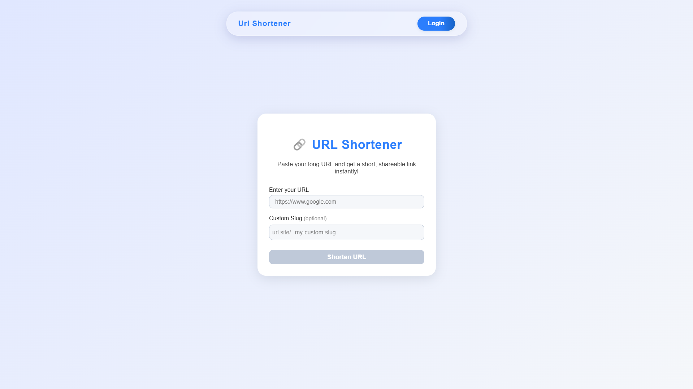
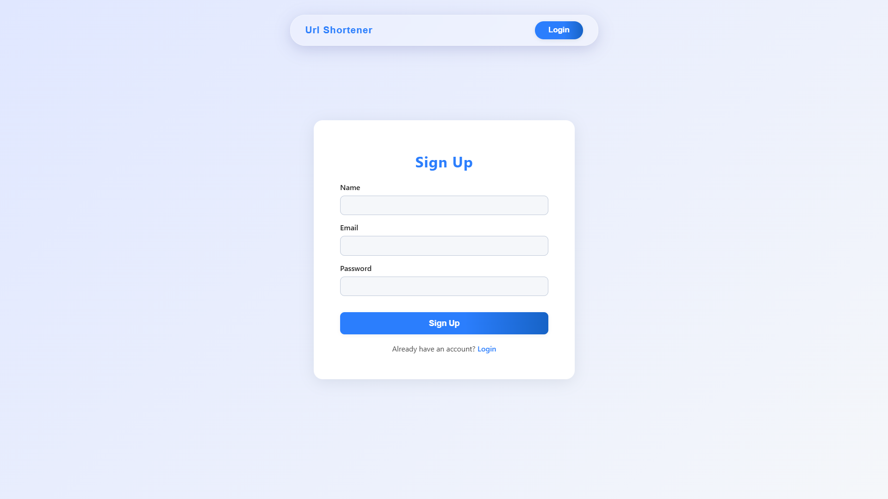
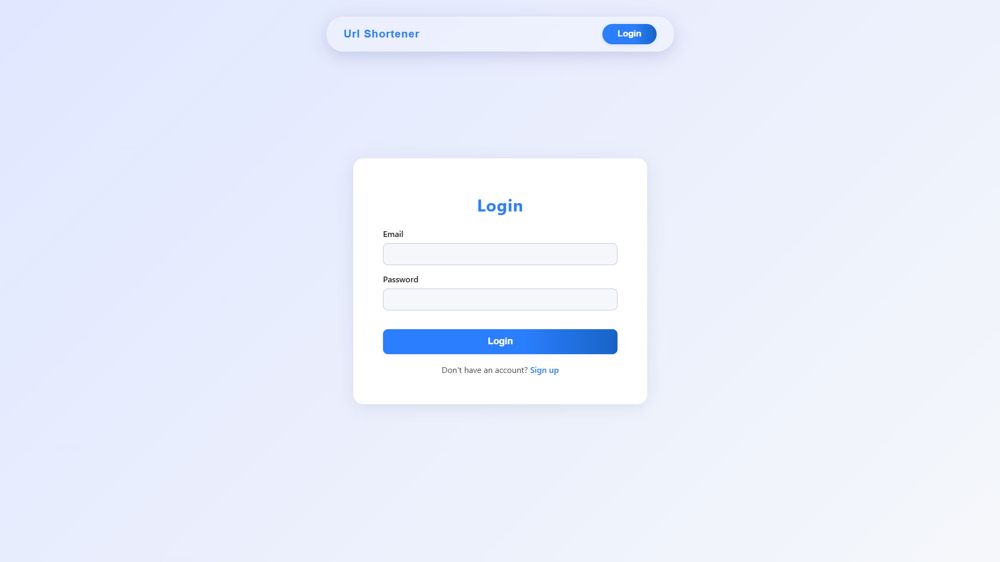
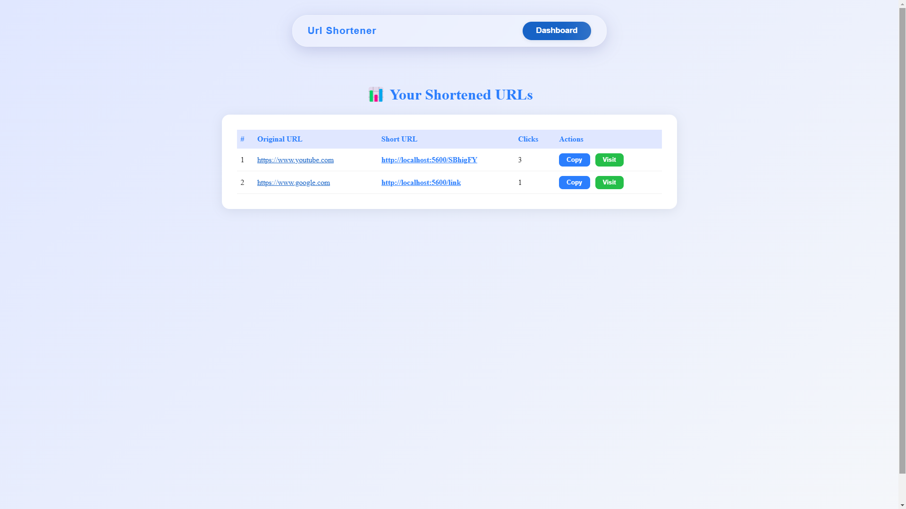
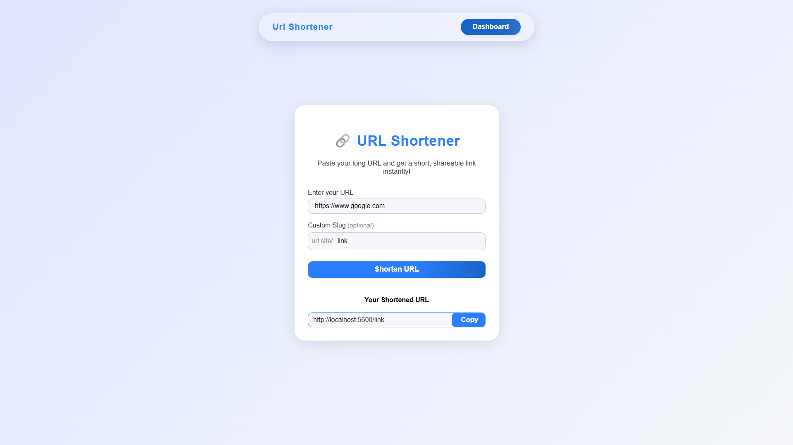

<div align="center">

<!--  -->

# ✨ URL Shortener - Simplify Your Links ✨

> 🔗 Shorten, Track, and Manage URLs with Ease

[](https://reactjs.org/)
[](https://vitejs.dev/)
[](https://axios-http.com/)
[](https://reactrouter.com/)
[](https://developer.mozilla.org/en-US/docs/Web/CSS)
[](https://nodejs.org/)
[](https://expressjs.com/)
[](https://www.mongodb.com/)
[](https://jwt.io/)

[](https://github.com/SubhodeepSamanta/URL-Shortener/stargazers)
[](https://github.com/SubhodeepSamanta/URL-Shortener/network/members)
[](https://github.com/SubhodeepSamanta/URL-Shortener/issues)

---

</div>

## ✨ Features

- 🔐 JWT-based User Authentication
- 🔗 Shorten long URLs with optional custom slugs
- 📊 Dashboard with click tracking and analytics
- 🔁 Redirection from short URL to original
- 📋 Copy short URLs with one click

## 🚀 Quick Start

### Prerequisites

- Node.js (v18 or higher)
- npm (v9 or higher)
- MongoDB URI
- Git

### 1. Clone the Repository

```bash
git clone https://github.com/SubhodeepSamanta/URL-Shortener.git
cd URL-Shortener
```

### 2. Backend Setup

```bash
cd backend
npm install

# Create .env file and add:
PORT=5000
MONGODB_URI=your_mongo_uri
JWT_SECRET=your_jwt_secret
```

### 3. Frontend Setup

```bash
cd ../frontend
npm install

# Create .env file and add:
VITE_BACKEND_URL=http://localhost:5000
```

### 4. Run the App

```bash
# Backend
cd backend
npm run dev

# Frontend (new terminal)
cd frontend
npm run dev
```

### 📁 Environment Variables

#### Backend

| Variable      | Description               | Example                              |
|---------------|---------------------------|--------------------------------------|
| `PORT`        | Server Port               | 5000                                 |
| `MONGODB_URI` | MongoDB Connection String | mongodb+srv://...                    |
| `JWT_SECRET`  | JWT Secret Key            | your-secret-key                      |

#### Frontend

| Variable          | Description     | Example              |
|-------------------|-----------------|----------------------|
| `VITE_BACKEND_URL`| API base URL    | http://localhost:5000|

## 🛠️ Tech Stack

### Frontend
- React
- Vite
- Axios
- React Router
- Custom CSS

### Backend
- Node.js
- Express.js
- MongoDB
- JWT

## 🖼️ Screenshots

<div align="center">

| Homepage | Signup | Login |
|---------|--------|-------|
|  |  |  |

| Dashboard | Working Example |
|-----------|------------------|
|  |  |

</div>

## 💻 Development Scripts

| Command        | Description           |
|----------------|-----------------------|
| `npm run dev`  | Starts frontend/backend in dev mode |

## 🤝 Contributing

We welcome contributions!

1. Fork this repo
2. Create your feature branch (`git checkout -b feature/AmazingFeature`)
3. Commit your changes (`git commit -m 'Add some feature'`)
4. Push to the branch (`git push origin feature/AmazingFeature`)
5. Open a Pull Request

## 📝 License

This project is licensed under the MIT License. See the [LICENSE](LICENSE) file for details.

## 🙏 Acknowledgments

- [React](https://reactjs.org/)
- [Vite](https://vitejs.dev/)
- [MongoDB](https://www.mongodb.com/)
- [Express](https://expressjs.com/)
- [JWT](https://jwt.io/)

---

<div align="center">

Made with ❤️ by [SubhodeepSamanta](https://github.com/SubhodeepSamanta)

</div>
